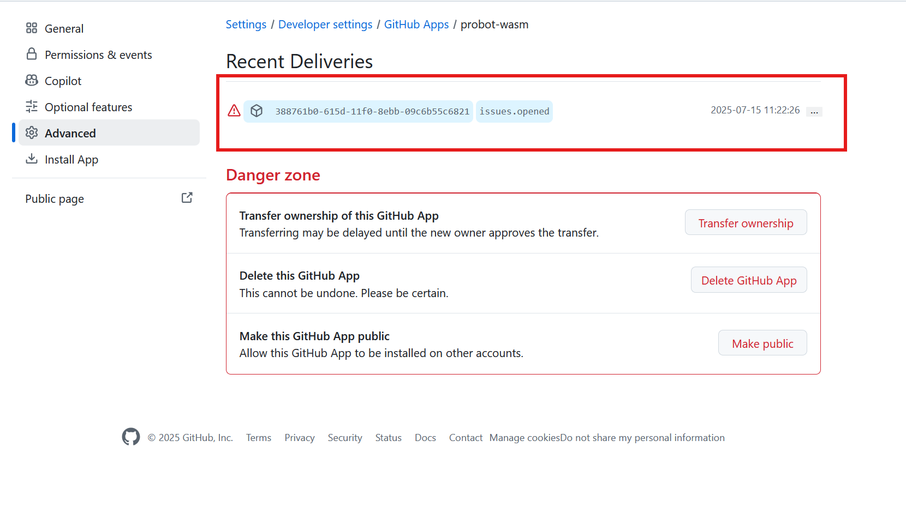

# Quickstart

# probot-wasm

This repo demonstrates creating a GitHub application using Probot and WebAssembly components.

## Prerequisites

Before you begin, you'll need to create a new GitHub application and test repository following the Probot documentation:

- [new-app][Create a new GitHub App]
- [conf-app][Manually configure your GitHub App]

## Configuration Checklist

Ensure you have the following from your GitHub App:

- `APP_ID` - Your application's unique identifier
- `PRIVATE_KEY` - Your app's private key (requires conversion, see below)
- Repository permissions for "issues"
- App installed on your test repository

### Converting the Private Key

GitHub provides private keys in PKCS#1 format, but the WebCrypto API requires PKCS#8. Convert your key using:

```console
openssl pkcs8 -topk8 -inform PEM -outform PEM -nocrypt -in private-key-pkcs1.pem -out private-key.key
```

## Building the Patched StarlingMonkey

1. Clone the ComponentizeJS Repository

Clone the specific branch that includes PKCS#8 support:

```console
git clone -b pkcs8 https://github.com/andreiltd/ComponentizeJS.git
cd ComponentizeJS
git submodule update --init --recursive
```

2. Apply StarlingMonkey Patches

Apply the patches that fix issues with accessing `performance.timeOrigin` during wizening:

```console
cd StarlingMonkey
git apply < ../patch/sm.patch
```

3. Build ComponentizeJS

```console
cd ..
npm install
npm run build
```

4. Create npm Link

Make the patched version available locally:

```console
npm link
```

## Setting Up the Probot Application

1. Navigate to Your Probot App and link the patched ComponentizeJS

This will make sure we use patched verision of StarlingMonkey

```console
cd ../probot-wasm
npm link ../ComponentizeJS  # Adjust path as needed
```

2. Build and Run

```console
npm install
npm run build
wasmtime serve -S common,http,inherit-network dist/probot-example.wasm
```

## Testing Your Application

1. Generate a Test Payload

- Navigate to your test repository (where the GitHub App is installed)
- Create a new issue
- Go to your App's settings page
- Navigate to the **Advanced** tab
- Click on one of the **Recent Deliveries** to expand it
- Copy the JSON from the **Payload** section
- Save it to a file named `payload.json`

2. Send the Test Request

Use the following `curl` command to send the payload to your running container:

```
curl -X POST 127.0.0.1:8080 \
  -H "Content-Type: application/json" \
  -H "X-GitHub-Event: issues" \
  -H "X-GitHub-Delivery: c1ed72c6-5bd8-11f0-972d-c64f455f0c73" \
  --data @payload.json
```



**Note:** The `X-GitHub-Delivery` header value can be obtained from the same Recent Deliveries page where you copied the payload.
